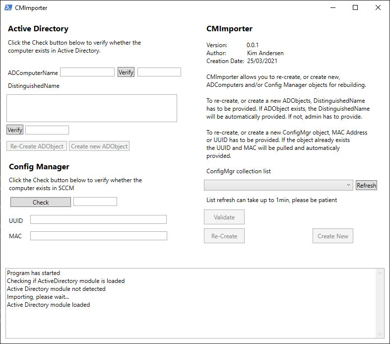

# CMImporter

 

Powershell based tool for either recreating/creating new AD and/or SCCM objects for faster builds

CMImporter currently uses the Powershell module for Config Manager, as i have not had time to set up the new rest API. Will be updated once installed and running in my lab.

Under construction

Please be careful if you decide to test any of these early realeases.